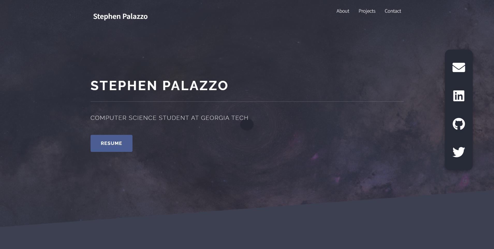

# Personal-Website

---

### Table of Contents

- [Description](#description)
- [Author Info](#author-info)

---

## Description

This repository is my personal website/portfolio. Made with the Solid State HTML5 UP Design

#### Technologies

- HTML
- CSS
- Vanilla Javascript

---

## How To Use

- Explore the page's content to learn about me
- Contact me with the form at the end

---

## Author Info

- LinkedIn - [@StephenPalazzo](https://www.linkedin.com/in/stephenpalazzo)
- Website - [Stephen Palazzo](https://stephenpalazzo.com)

[Back To The Top](#Personal-Website)
